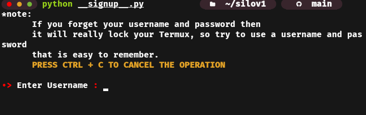
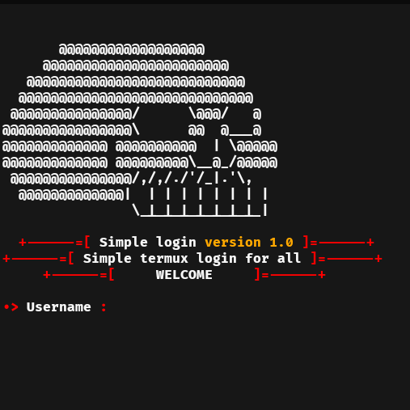

### silov1
simple termux login free use for al

### important
If you forget your username and password then it will really lock your Termux, so try to use a username and password that is easy to remember.

### Installation
$ ```pkg install python```

$ ```git clone https://github.com/im-r/silov1```

$ ```cd silov1```

$ ```python __signup__.py```

### Single use command
```
pkg install python && git clone https://github.com/im-r/silov1 && cd silov1 && python __signup__.py
```

## Screenshot

### Signup form


### Login form


### Find me on
<ul>
<li><a href="https://instagram.com/rfadllhwbsn"><text>Instagram</text></a></li>
</ul>
